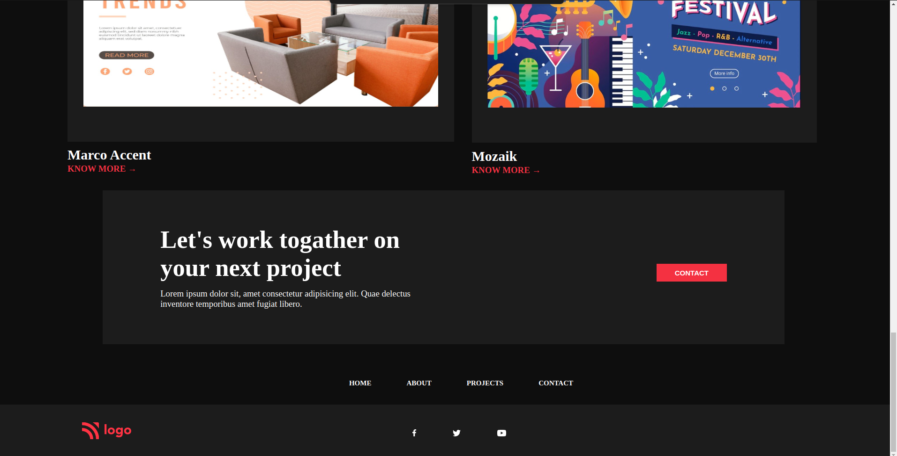

# Visual Designer | Page - HTML & CSS!

By Prince Kr Paswan

## [Link to the Visual Designer-Page (project-15)](https://seo-page.netlify.app/)

## What I learned While creating this page?

- learned section colouring.
- learned about transparent back .
- lerned aboutgrid.
- Learnd to use css position  property.
- learned how to add custom fonts.
- learned about image positioning and image hight.

## This project took around 8 hours to complete.
